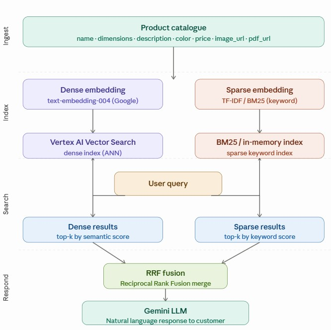

# 🛋️ Hybrid Search for E-Commerce Product Discovery (Vertex AI) with RAG-style LLM Augmentation

## 🚀 Overview

This project implements a **hybrid search system** for an e-commerce furniture platform (sofa category), combining:

- 🔍 **Keyword-based search (sparse retrieval)**
- 🧠 **Semantic search using embeddings (dense retrieval)**

The goal is to improve product discovery by understanding both:
- Exact keyword matches
- User intent and context

---

## 🖼️ Architecture Diagram



---

## 🎯 Problem Statement

Traditional e-commerce search systems rely heavily on keyword matching, which often leads to:

- Poor results for vague queries (e.g., "comfortable blue sofa")
- Missed semantic relationships
- Limited personalization

This project solves that by combining **semantic understanding + keyword precision**.

---

## 🧠 Solution Architecture

### 1. Product Representation
Each sofa is represented using structured attributes:
- Name
- Description
- Color
- Dimensions
- PDF URI
- Image URI

These are combined into a unified text format for embedding.

---

### 2. Dense Embeddings (Semantic Search)

- Generated using **Vertex AI Embeddings**
- Model: `text-embedding-004`
- Captures meaning and context
- Enables similarity-based retrieval

---

### 3. Sparse Retrieval (Keyword Search)

- Uses TF-IDF / BM25
- Ensures exact matches are not lost

---

### 4. Vector Indexing (Vertex AI Vector Search)

- Embeddings are stored in a **Vector Index (ANN)**
- Enables **low-latency similarity search at scale**
- Supports production-grade retrieval

---

### 5. Hybrid Search

Final ranking combines:
- Dense similarity score
- Sparse keyword score

Using:
- **Reciprocal Rank Fusion (RRF)**

---

### 6. LLM Response Layer

- Powered by **Gemini LLM**
- Converts retrieved results into natural language responses

---

## 🏗️ Tech Stack

- Python
- Vertex AI (Google Cloud)
- NumPy / Scikit-learn
- BM25 / TF-IDF
- Vector Search (ANN)

---

## 📂 Project Structure

```
├── Hybrid Search for E-Comm Product Discovery with RAG-style LLM Augmentation.ipynb
├── README.md
├── architecture.png
```

---

## ⚙️ How It Works

1. Convert product catalog into text format
2. Generate embeddings (for semantic dense embeddings and keyword sparse embedding) using Vertex AI
3. Index embeddings in Vector Search
4. Build BM25 index for keyword search
5. Accept user query
6. Retrieve:
   - Semantic results (dense)
   - Keyword results (sparse)
7. Merge using RRF
8. Generate final response using LLM

---

## 💡 Example Use Cases

- "Modern blue sofa for small living room"
- "3 seater leather couch"
- "comfortable fabric sofa under budget"

---

## 📈 Key Benefits

- Better search relevance
- Improved user experience
- Handles vague and natural language queries
- Production-ready architecture

---

## 🔮 Future Improvements

- Add personalization layer
- Real-time serving pipeline
- Learning-to-rank models
- Multi-modal search (image + text)

---
